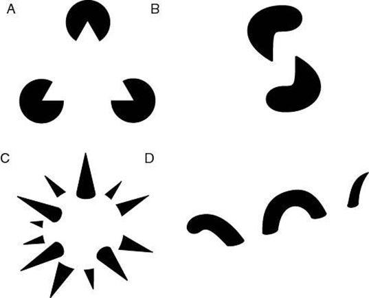

<!-- configuracion de colores es opcional pero ultil-->
<section id="themes">
	<h2>Themes setting</h2>
	

		Themes:  
		<a href="?#/themes">Default</a> -
		<a href="?theme=sky#/themes">Sky</a> -
		<a href="?theme=beige#/themes">Beige</a> -
		<a href="?theme=simple#/themes">Simple</a> -
		<a href="?theme=serif#/themes">Serif</a> -
		<a href="?theme=night#/themes">Night</a>  
		<a href="?theme=moon#/themes">Moon</a> -
		<a href="?theme=solarized#/themes">Solarized</a>
	

</section>

Slide:

# Las reglas del arte

##Elementos y principios
##(léxico y sintaxis)

Profesor:

Oscar Andrade Medina

Slide:

 

Slide:

##Artes temporales / Artes espaciales

#? | ?

Slide:

##Elementos del Arte (léxico)

* Espacio<!-- .element: class="fragment" data-fragment-index="1"-->
* Tiempo<!-- .element: class="fragment" data-fragment-index="2"-->
* Luz / Sombra (Valor)<!-- .element: class="fragment" data-fragment-index="3"-->
* Forma<!-- .element: class="fragment" data-fragment-index="4"-->
* Color<!-- .element: class="fragment" data-fragment-index="5"-->
* Textura<!-- .element: class="fragment" data-fragment-index="6"-->

Slide:

##Espacio (1 de 5)

<!-- .element: class="fragment" data-fragment-index="1"--><!-- .element: class="fragment" data-fragment-index="2"--> 

La libertad guiando al pueblo - <!-- .element: class="fragment" data-fragment-index="3"--><!-- .element: class="fragment" data-fragment-index="1"-->[Delacroix](http://es.wikipedia.org/wiki/Eug%C3%A8ne_Delacroix)<!-- .element: class="fragment" data-fragment-index="1"--> 

El nacimiento de Venus - Sandro<!-- .element: class="fragment" data-fragment-index="2"-->[Botticelli](http://es.wikipedia.org/wiki/Sandro_Botticelli)<!-- .element: class="fragment" data-fragment-index="2"-->

Pregunta: ¿Todos los lienzos son rectangulares?<!-- .element: class="fragment" data-fragment-index="5"-->

Slide:

##Espacio (2 de 5)

<!-- .element: class="fragment" data-fragment-index="1"--><!-- .element: class="fragment" data-fragment-index="2"--><!-- .element: class="fragment" data-fragment-index="3"-->

Ejemplos de lienzos no rectangulares<!-- .element: class="fragment" data-fragment-index="3"-->

Slide:

##Espacio (3 de 5)

<!-- .element: class="fragment" data-fragment-index="1"--><!-- .element: class="fragment" data-fragment-index="2"--><!-- .element: class="fragment" data-fragment-index="3"-->

Futbol<!-- .element: class="fragment" data-fragment-index="1"-->

Super Mario Bros<!-- .element: class="fragment" data-fragment-index="2"--> 

Tetris<!-- .element: class="fragment" data-fragment-index="3"-->

¿Todos los juegos ocurren en espacios rectangulares?<!-- .element: class="fragment" data-fragment-index="3"-->

Slide:

##Espacio (4 de 5)

<!-- .element: class="fragment" data-fragment-index="1"--><!-- .element: class="fragment" data-fragment-index="2"--><!-- .element: class="fragment" data-fragment-index="3"-->

[Spacewar](http://es.wikipedia.org/wiki/Spacewar!)<!-- .element: class="fragment" data-fragment-index="1"-->
-[Settlers of Catam](http://www.catan.com/)<!-- .element: class="fragment" data-fragment-index="2"-->
-[Tron](https://www.youtube.com/watch?v=MOllAzeZpuU)<!-- .element: class="fragment" data-fragment-index="3"-->

Slide:

##Espacio (5 de 5)
<!-- .element: class="fragment" data-fragment-index="1"--><!-- .element: class="fragment" data-fragment-index="2"--> 
[Cricket](http://es.wikipedia.org/wiki/Cr%C3%ADquet)<!-- .element: class="fragment" data-fragment-index="1"-->
-[Halo](http://es.wikipedia.org/wiki/Mundo_Anillo)<!-- .element: class="fragment" data-fragment-index="2"--> 

Slide:

##Tiempo (1 de 4)

¿Cuánto dura cada figura musical? 

¿Cuánto dura un compás en el pentagrama?

Slide:

##Tiempo (2 de 4)
<!-- .element: class="fragment" data-fragment-index="1"--><!-- .element: class="fragment" data-fragment-index="2"--> 

Puntuación en la literatura<!-- .element: class="fragment" data-fragment-index="1"-->

Slide:

##Tiempo (3 de 4)

[Notación de danza](http://en.wikipedia.org/wiki/Dance_notation) de [Rudolph Laban](http://en.wikipedia.org/wiki/Labanotation)

Slide:

##Tiempo (4 de 4)

<!-- .element: class="fragment" data-fragment-index="1"--><!-- .element: class="fragment" data-fragment-index="2"--><!-- .element: class="fragment" data-fragment-index="3"-->

[Need for speed](https://www.youtube.com/watch?v=DSr_JVTp8fI)<!-- .element: class="fragment" data-fragment-index="1"-->
-[Max Payne](https://www.youtube.com/watch?v=4jG7Tr-Tb74)<!-- .element: class="fragment" data-fragment-index="2"-->
-[Braid](https://www.youtube.com/watch?v=LsCaN63YXM8)<!-- .element: class="fragment" data-fragment-index="3"-->

Slide:

##Luz / Sombra (1 de 4)

<!-- .element: class="fragment" data-fragment-index="1"--><!-- .element: class="fragment" data-fragment-index="2"--><!-- .element: class="fragment" data-fragment-index="3"-->

[Sin City](http://es.wikipedia.org/wiki/Sin_City)<!-- .element: class="fragment" data-fragment-index="1"-->
-[Rembrandt](http://es.wikipedia.org/wiki/Rembrandt)<!-- .element: class="fragment" data-fragment-index="2"-->
-[Escher](http://es.wikipedia.org/wiki/M._C._Escher)<!-- .element: class="fragment" data-fragment-index="3"-->

La luz y la sombra es lo segundo que el ojo ve, antes que el color<!-- .element: class="fragment" data-fragment-index="3"-->

Slide:

##Luz / Sombra (2 de 4)

<!-- .element: class="fragment" data-fragment-index="1"--><!-- .element: class="fragment" data-fragment-index="2"--> 

[Leyes de la Gestalt](http://es.wikipedia.org/wiki/Psicolog%C3%ADa_de_la_Gestalt)<!-- .element: class="fragment" data-fragment-index="1"-->

Slide:

##Luz / Sombra (3 de 4)

<!-- .element: class="fragment" data-fragment-index="1"--><!-- .element: class="fragment" data-fragment-index="2"--> 

[Limbo](https://www.youtube.com/watch?v=GCA79zPaQe0)<!-- .element: class="fragment" data-fragment-index="1"-->
-[Silent Hill](https://www.youtube.com/watch?v=WI5FCJF-Fas)<!-- .element: class="fragment" data-fragment-index="2"-->

Slide:

##Luz / Sombra (4 de 4)

<!-- .element: class="fragment" data-fragment-index="1"--><!-- .element: class="fragment" data-fragment-index="2"--> 

[Echochrome](https://www.youtube.com/watch?v=wLJiv9Aeo2c)<!-- .element: class="fragment" data-fragment-index="1"-->
-[Closure](https://www.youtube.com/results?search_query=closure+gameplay)<!-- .element: class="fragment" data-fragment-index="2"-->

Slide:

##Forma

<!-- .element: class="fragment" data-fragment-index="1"--><!-- .element: class="fragment" data-fragment-index="2"--> 

[Poporo Quimbaya](http://www.banrepcultural.org/blaavirtual/publicacionesbanrep/bolmuseo/1978/bol2/bof2.htm)<!-- .element: class="fragment" data-fragment-index="1"-->
-[Arte Precolombino](https://www.google.com/search?q=antonio+grass&client=ubuntu&hs=7Sv&channel=fs&biw=1280&bih=878&source=lnms&tbm=isch&sa=X&ei=0L35VML-OsTBggSihIO4Aw&ved=0CAYQ_AUoAQ)<!-- .element: class="fragment" data-fragment-index="2"-->

Slide:

##Forma

<!-- .element: class="fragment" data-fragment-index="1"--><!-- .element: class="fragment" data-fragment-index="2"--> 

[Vasos Griegos](http://www.ancient.eu/article/489/)<!-- .element: class="fragment" data-fragment-index="1"-->
-[Iconos religiosos rusos](http://www.odisea2008.com/2009/03/iconos-religiosos-rusos.html)<!-- .element: class="fragment" data-fragment-index="2"-->

Slide:

##Forma

[Brunelleschi](https://www.khanacademy.org/humanities/renaissance-reformation/early-renaissance1/beginners-renaissance-florence/v/linear-perspective-brunelleschi-s-experiement) - surgimiento de la perspectiva en la pintura, basado en la [cámara oscura](http://es.wikipedia.org/wiki/C%C3%A1mara_oscura)

Slide:

##Forma

<!-- .element: class="fragment" data-fragment-index="1"--><!-- .element: class="fragment" data-fragment-index="2"--> 

[Michelangelo Buonarotti](http://es.wikipedia.org/wiki/Miguel_%C3%81ngel)<!-- .element: class="fragment" data-fragment-index="1"-->
-[Vermeer](http://es.wikipedia.org/wiki/Johannes_Vermeer)<!-- .element: class="fragment" data-fragment-index="2"-->

Slide:

##Forma

<!-- .element: class="fragment" data-fragment-index="1"--><!-- .element: class="fragment" data-fragment-index="2"--> 

[Wassily Kandinsky](http://es.wikipedia.org/wiki/Vasili_Kandinski)<!-- .element: class="fragment" data-fragment-index="1"-->
-[Pablo Picasso](http://es.wikipedia.org/wiki/Pablo_Picasso)<!-- .element: class="fragment" data-fragment-index="2"-->

Slide:

##Forma

[Escuela Bauhaus](http://es.wikipedia.org/wiki/Escuela_de_la_Bauhaus)

Círculo (Esfera)-Triángulo (Pirámide)-Cuadrado (Cubo)

Slide:

##Forma

<!-- .element: class="fragment" data-fragment-index="1"--><!-- .element: class="fragment" data-fragment-index="2"--><!-- .element: class="fragment" data-fragment-index="3"-->

[Call of duty (Hiperreal)](http://es.wikipedia.org/wiki/Call_of_Duty)<!-- .element: class="fragment" data-fragment-index="1"-->
-[Journey(Pictórico)](http://thatgamecompany.com/games/journey/)<!-- .element: class="fragment" data-fragment-index="2"-->
-[World of Goo(No realista)](http://es.wikipedia.org/wiki/World_of_Goo)<!-- .element: class="fragment" data-fragment-index="3"-->

